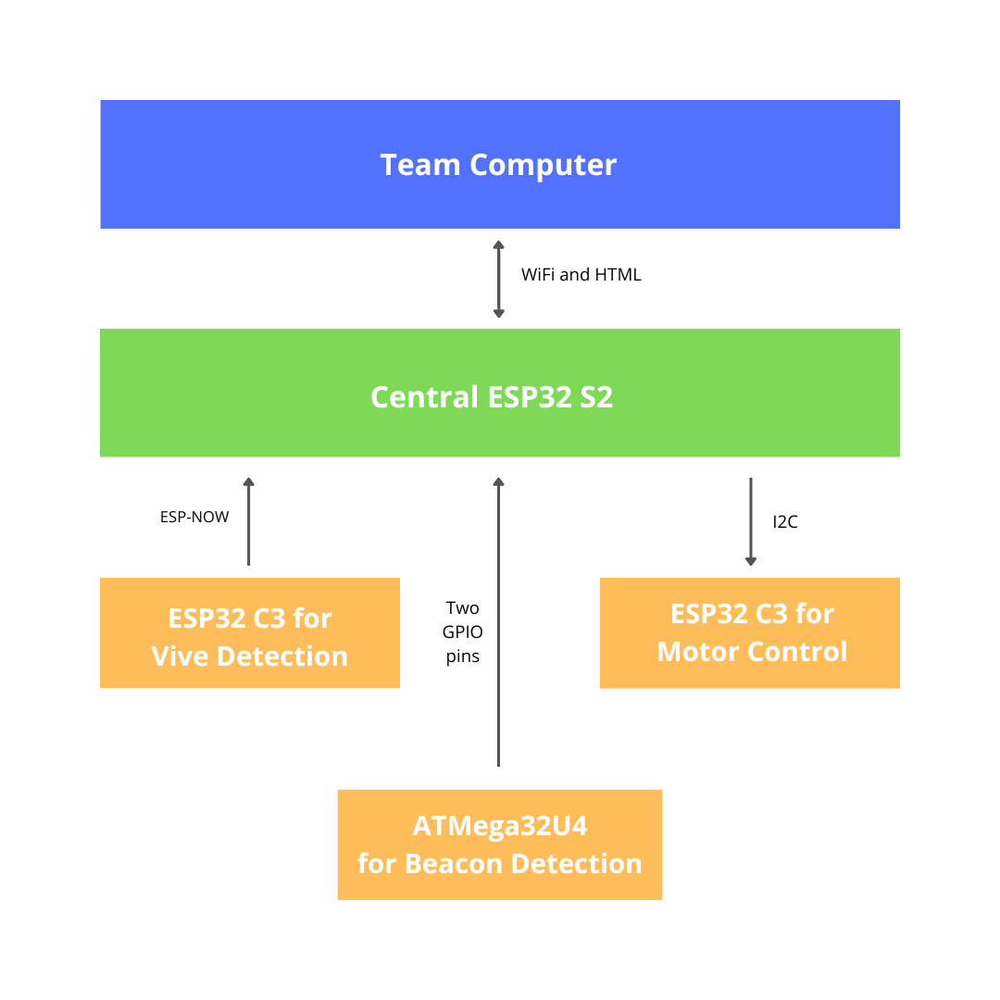

# Mecanum Robot

## Overview

This codebase can be used to build an autonomous mobile robot that can follow a wall, track and grab a beacon, and localize itself and nearby objects. We employed the ESP32 family of microprocessors for edge computing and HTC Vive for localization. We used direct current (DC) motors to drive the wheels and infrared (IR) phototransistors to detect the beacons.

In terms of unique design choices, we chose to create a holonomic mobile base using mecanum wheels to attain velocity in any direction. We also added a Light Detection and Ranging (LIDAR) sensor, ultrasonic distance sensors, and an IR distance sensor to detect the wall, obstacles, and the beacon once grasped. We employed two servo motors that actuated two claws which could capture the beacon once it was in close range. Since there were multiple elements to the project and to facilitate parallel work, we decided to split functionality between three different ESP32 microprocessors - a low-level C3 for motor control, another low-level C3 for Vive localization, and a high-level S2 to perform logic calculations and interface with the user through WiFi. Finally, we powered the entire system with a Lithium Polymer (LiPo) battery and a power bank.

## Architecture

The diagram above depicts the structure of the system. The low-level microcontrollers send signals to the central ESP32 S2 controller which makes logical decisions depending on the selected behavior.

## Follow wall (2X speed)

(GIF takes a few seconds to load)

## Push police car

(GIF takes a few seconds to load)

## Track an IR beacon

(GIF takes a few seconds to load)

